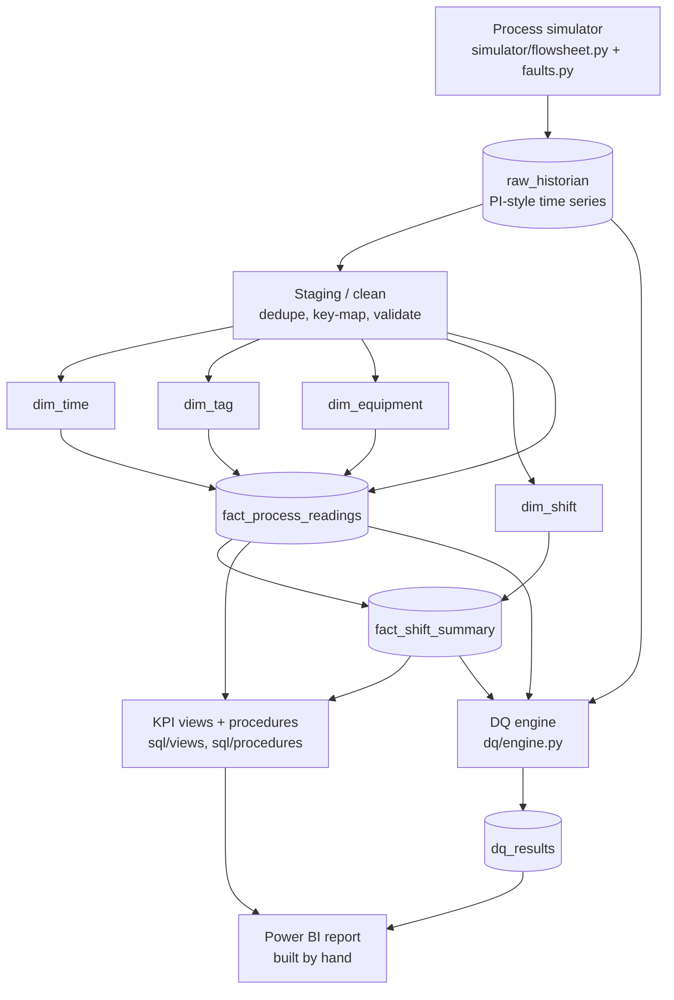

# Data Lineage

End-to-end flow from the synthetic source to the Power BI report.
Each box is a real artifact in this repo.

## Layer responsibilities

| Layer | Artifact | Responsibility |
| --- | --- | --- |
| Source | `simulator/` | Correlated synthetic tags + seeded faults |
| Raw | `raw_historian` | PI-style landing zone with quality flags |
| Staging | `warehouse/load.py` | Dedupe, key-map, conform dimensions |
| Warehouse | `fact_*`, `dim_*` | Star schema |
| Semantic | `sql/views`, `warehouse/kpi.py` | KPI definitions |
| Quality | `dq/engine.py` -> `dq_results` | Rules + mass balance |
| Report | Power BI (`.pbix`) | Built by hand on the KPI layer |
