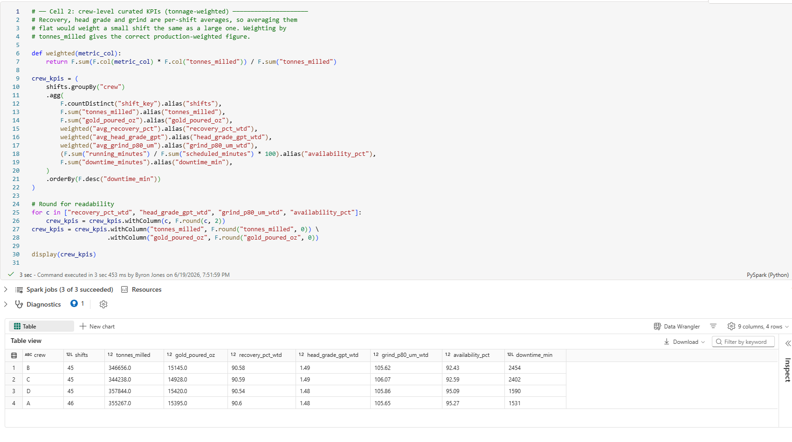
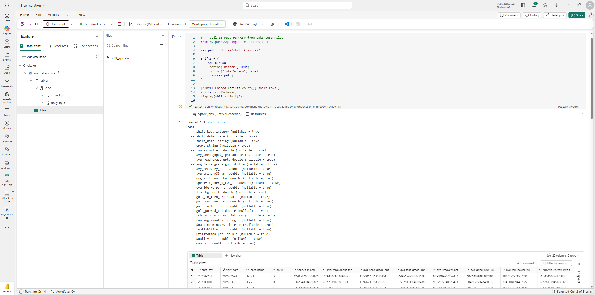
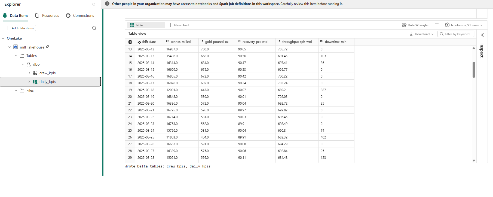

# Microsoft Fabric

A PySpark notebook that curates the shift KPI data in a Fabric Lakehouse. It reads the Postgres export, computes tonnage-weighted KPIs, and writes curated Delta tables back to the lakehouse.



## What it does

`mill_kpi_curation.py` runs in a Fabric notebook attached to a Lakehouse. The shift KPI view is exported from Postgres to CSV and uploaded to the lakehouse Files area. The notebook then:

- Reads `Files/shift_kpis.csv` into a Spark DataFrame.
- Rolls the per-shift data up to two grains: by crew and by day.
- Weights recovery, head grade, grind, and throughput by `tonnes_milled`, so a large shift counts more than a small one. Availability is recomputed from summed running and scheduled minutes, and downtime is summed.
- Writes the output as managed Delta tables (`crew_kpis`, `daily_kpis`) under Tables, queryable through the SQL endpoint and Power BI.

Raw files in, curated tables out.



The curated daily rollup lands in the lakehouse as a Delta table:



## Result

The crew rollup matches the Power BI report: downtime concentrates in two crews, while recovery holds near-identical across all four. Recovery tracks grade and grind, not crew.

## Running it

Export the shift KPI view from the Postgres warehouse:

```bash
docker exec mill_warehouse psql -U mill -d mill -c "\copy (SELECT * FROM v_shift_kpis) TO '/tmp/shift_kpis.csv' CSV HEADER"
docker cp mill_warehouse:/tmp/shift_kpis.csv ./shift_kpis.csv
```

Upload `shift_kpis.csv` to the lakehouse Files area, attach the lakehouse to the notebook, and run the cells top to bottom.
