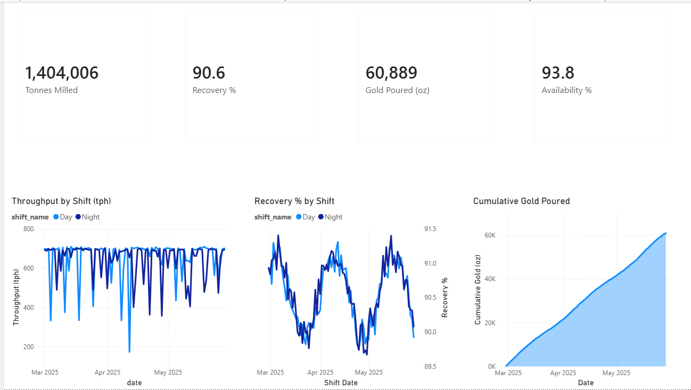
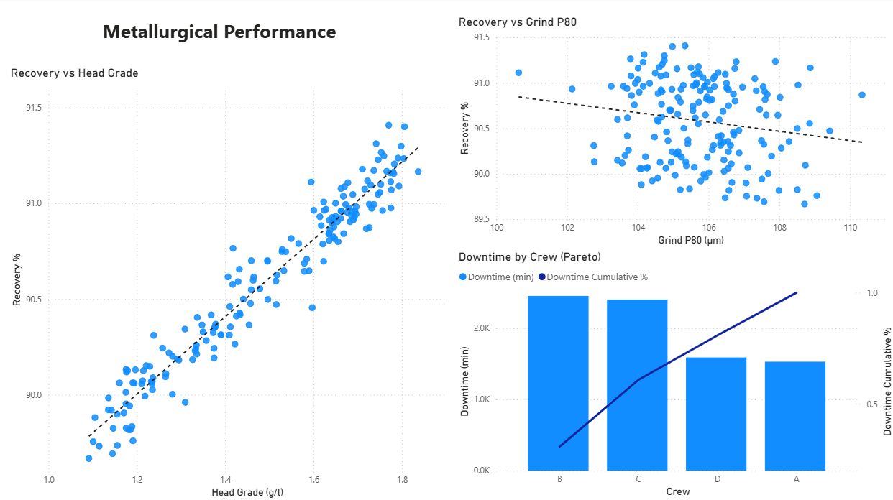
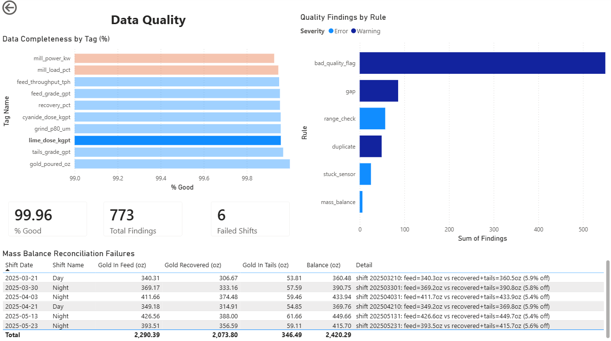

# Power BI Report

A three-page operational report for the mill reporting platform, built in Power BI Desktop against the Postgres KPI views. It covers mill performance, metallurgy, and data quality over the 90-day campaign.

*1.40 Mt milled · 60,889 oz poured · 90.6% recovery · 93.8% availability*

## Pages

### Operations

Headline KPIs — tonnes milled, recovery, gold poured, availability — above throughput, recovery, and cumulative-gold trends. Throughput dips mark downtime events, and day and night shifts are overlaid on each trend.



### Metallurgy

Recovery plotted against head grade and against grind P80, each with a fitted trend line. Grade is the dominant driver of recovery; grind size is a weaker inverse factor. A crew-level downtime Pareto sits alongside.



### Data Quality

Completeness per sensor tag, with tags below threshold flagged. Findings are grouped by rule and severity, and a mass-balance reconciliation table lists the shifts where gold in didn't equal gold out. Cards summarise overall completeness, total findings, and failed-shift count.



## Model

Every numeric KPI is a measure, not a raw column. Per-shift values (recovery, grade, grind) are tonnage-weighted rather than flat-averaged, so multi-shift totals stay correct. A dedicated `Calendar` table drives the date axes and the cumulative running totals, and raw fact columns are hidden so only measures and slicer fields are exposed. Date, shift, and crew slicers are synced across all three pages.

## Running it

The report reads from the platform's Postgres database (Docker, `localhost:5433`). Start the database and load data before opening the report:

```bash
python -m mill all --reset --full   # generate and load a full dataset
python -m mill load                 # incremental load of new data only
```

Open `Mill-Reporting-Platform.pbix` and hit Home → Refresh. It points at the KPI views, so it reflects whatever is currently loaded.

## Notes

- Sensor tag names (`mill_power_kw`) and DQ rule names (`stuck_sensor`) are the real identifiers from the data layer, not display labels.
- The completeness threshold is set tight for demonstration. In practice it would be a governance decision, set per tag by criticality.
